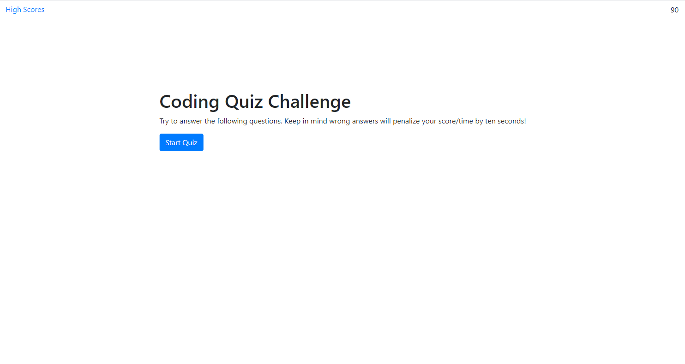
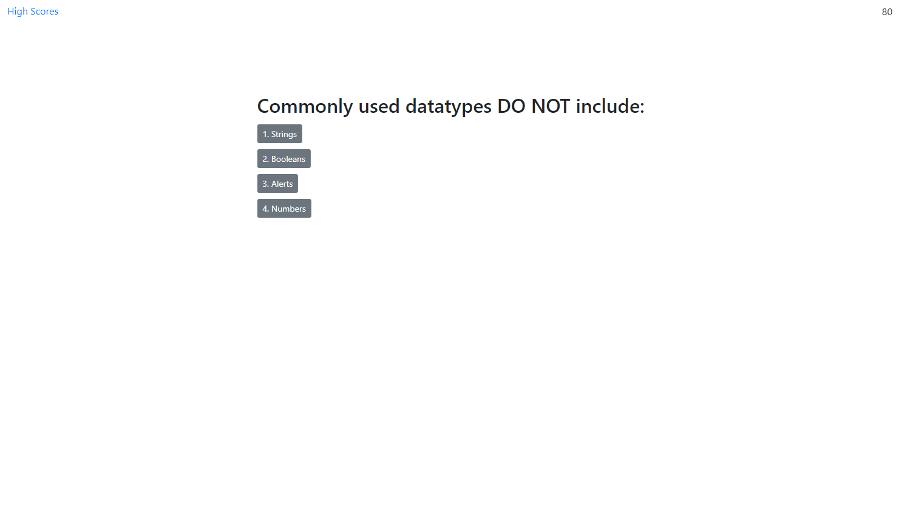
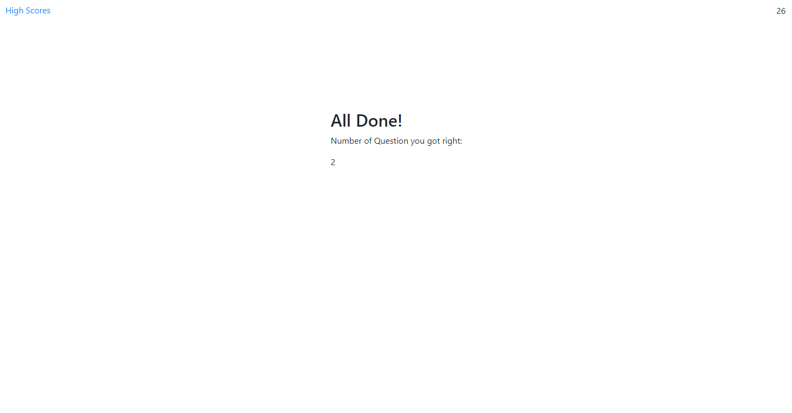

# Web-APIs-Code-Quiz
Description
This project is a timed "Code Quiz" that keeps track of your score and also takes time off for every incorrect answer selectected. When done, your score is displayed. The funcitonality was suppose to go beyond that to allow you to enter your name and view highscores in local storage, but I ran out of time and ran into difficulties with local storage. Having difficutly with this assignment shows me that I need to review more about localStorage and how it functions so I can use it properly. I also feel that my code in my Javascript is very repetive and needs to be condensed.

Below I have included some screenshots that display the functionality I was able to complete. The first photo displays the first page you see when clicking a link, which includes the start button. The second photo shows how the timer begins when you click this button and displays your first question. The third shows that the score is displayed when finished with this quiz. 

Installation

None required, just follow link https://julieanni.github.io/Web-APIs-Code-Quiz/

Usage

The purpose of the project is to show ability timed quiz that keeps score of how many right answers a user selected and also takes time off whenever they selected a wrong answer. They were also suppose to be able to enter their name and see a high-score list that would be stored and cleared on command.

Credits
Thank you to my instructor and TA's who helped answer questions and taught me how to make this project possible. 

License
MIT License 

Copyright (c) 2020 JulieAnnI

Permission is hereby granted, free of charge, to any person obtaining a copy
of this software and associated documentation files (the "Software"), to deal
in the Software without restriction, including without limitation the rights
to use, copy, modify, merge, publish, distribute, sublicense, and/or sell
copies of the Software, and to permit persons to whom the Software is
furnished to do so, subject to the following conditions:

The above copyright notice and this permission notice shall be included in all
copies or substantial portions of the Software.

THE SOFTWARE IS PROVIDED "AS IS", WITHOUT WARRANTY OF ANY KIND, EXPRESS OR
IMPLIED, INCLUDING BUT NOT LIMITED TO THE WARRANTIES OF MERCHANTABILITY,
FITNESS FOR A PARTICULAR PURPOSE AND NONINFRINGEMENT. IN NO EVENT SHALL THE
AUTHORS OR COPYRIGHT HOLDERS BE LIABLE FOR ANY CLAIM, DAMAGES OR OTHER
LIABILITY, WHETHER IN AN ACTION OF CONTRACT, TORT OR OTHERWISE, ARISING FROM,
OUT OF OR IN CONNECTION WITH THE SOFTWARE OR THE USE OR OTHER DEALINGS IN THE
SOFTWARE.
